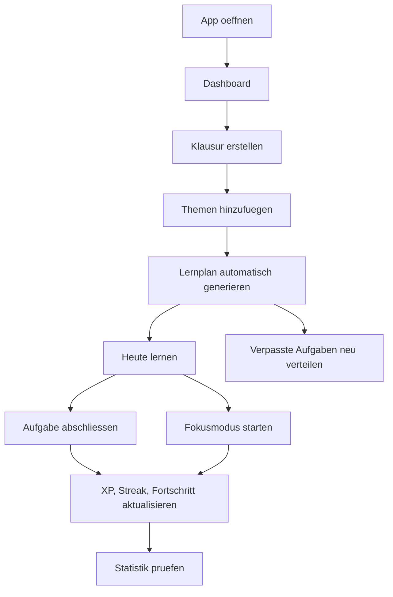

# Klausurplaner PWA

Klausurplaner ist eine mobile-first Progressive Web App fuer Schueler. Die App organisiert Klausuren, generiert Lernplaene, trackt Fortschritt und kombiniert Fokusmodus, Analytics und Gamification.

## Stack

- React 19
- Vite 7
- lucide-react fuer Icons
- LocalStorage als lokale Datenbank
- Web App Manifest und eigener Service Worker
- Mobile-first CSS mit Dark Mode

## Lokal starten

```powershell
npm install
npm run dev
```

Danach im Browser oeffnen:

```text
http://localhost:5173
```

Falls Port `5173` belegt ist:

```powershell
npm run dev -- --port 5174
```

Produktionsbuild:

```powershell
npm run build
```

## Google Login

Die App nutzt Supabase Auth mit dem Google OAuth Provider. Lokal ist die bereitgestellte Client-ID in `.env` hinterlegt:

```text
VITE_GOOGLE_CLIENT_ID=453682404003-h2rnpp1tdg3t4ifs8tvq7c52attuf7cm.apps.googleusercontent.com
VITE_AUTH_REDIRECT_URL=http://localhost:5177/dashboard
VITE_DEV_SERVER_PORT=5174
VITE_DEV_HMR_CLIENT_PORT=5177
```

Damit der Login funktioniert, muss Google in Supabase aktiviert sein:

1. In Supabase `Authentication` -> `Providers` -> `Google` oeffnen.
2. Google Provider aktivieren und Google Client-ID plus Client Secret eintragen.
3. In Supabase `Authentication` -> `URL Configuration` die Redirect URL `http://localhost:5177/dashboard` erlauben.
4. In der Google Cloud Console dieselbe Redirect URL fuer den OAuth Client erlauben, falls sie dort noch fehlt.

## GLM KI mit DeepSeek-Fallback ueber Supabase Edge Function

Die GLM API von Zhipu und die DeepSeek API werden nicht direkt aus dem Browser aufgerufen. Das Frontend ruft `supabase.functions.invoke("ai-coach")` auf; die Edge Function prueft das Supabase Auth JWT, validiert Eingaben, begrenzt Requests pro Nutzer und ruft erst GLM auf. Wenn GLM nicht erreichbar ist, wird DeepSeek versucht. Erst wenn beide Provider fehlschlagen, nutzt das Frontend automatisch den lokalen Mock-Fallback.

Edge Function deployen:

```powershell
supabase login
supabase link --project-ref <dein-project-ref>
supabase secrets set GLM_API_KEY="<dein-zhipu-api-key>"
supabase secrets set GLM_MODEL="glm-4-flash"
supabase secrets set DEEPSEEK_API_KEY="<dein-deepseek-api-key>"
supabase secrets set DEEPSEEK_MODEL="deepseek-v4-flash"
supabase functions deploy ai-coach
```

Lokal testen:

```powershell
supabase functions serve ai-coach --env-file ./supabase/.env.local
```

`supabase/.env.local` sollte nur lokal existieren und nicht ins Frontend:

```text
GLM_API_KEY=...
GLM_MODEL=glm-4-flash
DEEPSEEK_API_KEY=...
DEEPSEEK_MODEL=deepseek-v4-flash
```

Optional kann `GLM_API_BASE` gesetzt werden, falls Zhipu einen anderen OpenAI-kompatiblen Chat-Completions-Endpunkt verwenden soll. Standard ist `https://open.bigmodel.cn/api/paas/v4/chat/completions`.
Optional kann `DEEPSEEK_API_BASE` gesetzt werden. Standard ist `https://api.deepseek.com/chat/completions`.

Wichtig: `GLM_API_KEY` und `DEEPSEEK_API_KEY` nicht in `.env`, `.env.example` oder als `VITE_*` Variable eintragen. Nur Supabase Secrets oder lokale Function-ENV verwenden.

## MVP-Funktionen

- Klausuren erstellen: Fach, Datum, Uhrzeit, Raum, Notizen, Schwierigkeit, Wissensstand, Lernzeit
- Themenmanagement mit Checkboxen und Fortschritt in Prozent
- Automatischer Lernplan mit Prioritaetsformel
- Spaced-Repetition-Intervalle: Tag 1, 2, 5, 10, 18
- 70/20/10-Aufteilung: Lernen, Wiederholung, Puffer
- Neuverteilung verpasster Aufgaben
- Dashboard mit naechster Klausur, Countdown, XP, Level, Streak und Fokuszeit
- Kalenderansicht fuer Woche und Monat
- Pomodoro-Fokusmodus 25/5
- Analytics mit Lernzeit, Fortschritt und Schwachstellen
- AI Trainer als Chat mit Coach-, Quiz-, Flashcard-, Plan- und Erklaermodus
- Dark Mode, LocalStorage, Manifest, Service Worker, Offline-Cache

## Projektstruktur

```text
index.html
package.json
vite.config.js
src/
  main.jsx       React-App, Komponenten, State, Lernplanlogik
  styles.css     Designsystem und responsive UI
public/
  manifest.webmanifest
  sw.js
  icons/
```

## Architektur

Der MVP ist eine reine Client-PWA:

```text
React UI
  Komponenten fuer Dashboard, Kalender, Klausuren, Lernplan, Fokus, Statistik, Settings
State Layer
  usePersistentState + LocalStorage
Domain Logic
  Lernplan-Generator, Spaced Repetition, XP/Streak/Level, Neuverteilung
PWA Layer
  Manifest, Service Worker, Install Prompt, Offline Cache
```

Fuer Cloud Sync kann dieselbe Datenstruktur in Supabase, Firebase oder einer eigenen REST API gespeichert werden.

## UI Design Konzept

- Stil: clean, ruhig, produktiv, angelehnt an Notion/Todoist mit motivierenden Duolingo-Elementen
- Layout: mobile-first, Bottom Navigation auf kleinen Screens, Sidebar auf Desktop
- Komponenten: Karten fuer Klausuren, Aufgaben und Kennzahlen; Fortschrittsbalken; Status-Pills
- Farben: Fachfarben pro Klausur, neutrale Flaechen, klare Primaeraktion
- Dark Mode: global ueber CSS-Variablen
- Interaktion: direkte Aktionen, kurze Formulare, sichtbarer Fortschritt

## Datenmodell

### Exams

```json
{
  "id": "exam_123",
  "subject": "Mathe",
  "date": "2026-06-25",
  "time": "09:00",
  "room": "B112",
  "notes": "Ableitungen, Kurvendiskussion",
  "difficulty": 4,
  "knowledgeLevel": 2,
  "dailyMinutes": 45,
  "color": "#2563eb"
}
```

### Topics

```json
{
  "id": "topic_123",
  "examId": "exam_123",
  "name": "Kurvendiskussion",
  "completed": false
}
```

### StudyPlan

```json
{
  "id": "task_123",
  "examId": "exam_123",
  "date": "2026-06-18",
  "task": "Kurvendiskussion lernen",
  "type": "lernen",
  "duration": 45,
  "status": "open"
}
```

### UserStats

```json
{
  "studyTime": 180,
  "streak": 4,
  "xp": 320,
  "level": 4,
  "lastStudyDate": "2026-06-16"
}
```

## Lernplan-Algorithmus

Prioritaet:

```text
prioritaet = (schwierigkeit * 2) + (6 - wissensstand)
```

Verteilung:

```text
70% neue Inhalte
20% Wiederholung
10% Puffer
```

Spaced Repetition:

```text
Tag 1, 2, 5, 10, 18
```

Verpasste Aufgaben werden auf kommende Tage verschoben. Im MVP passiert das manuell ueber `Verpasste neu verteilen`; produktiv sollte das automatisch beim App-Start oder ueber einen Background Job laufen.

## API Design

```text
POST   /api/auth/google
GET    /api/me

GET    /api/exams
POST   /api/exams
GET    /api/exams/:id
PATCH  /api/exams/:id
DELETE /api/exams/:id

GET    /api/exams/:examId/topics
POST   /api/exams/:examId/topics
PATCH  /api/topics/:id
DELETE /api/topics/:id

POST   /api/exams/:examId/study-plan/generate
GET    /api/study-plan?from=2026-06-16&to=2026-06-23
PATCH  /api/study-plan/:id
POST   /api/study-plan/redistribute

GET    /api/stats
POST   /api/focus-sessions

POST   /api/ai/optimize-plan
POST   /api/ai/generate-quiz
POST   /api/ai/generate-flashcards
POST   /api/ai/coach
```

## Beispiel Backend

```js
import express from "express";

const app = express();
app.use(express.json());

const exams = [];
const topics = [];
const studyPlan = [];

app.post("/api/exams", (req, res) => {
  const exam = { id: crypto.randomUUID(), ...req.body };
  exams.push(exam);
  res.status(201).json(exam);
});

app.get("/api/exams", (req, res) => {
  res.json(exams);
});

app.post("/api/exams/:examId/topics", (req, res) => {
  const topic = { id: crypto.randomUUID(), examId: req.params.examId, completed: false, ...req.body };
  topics.push(topic);
  res.status(201).json(topic);
});

app.listen(3000);
```

## User Flow



## Erweiterungen

1. Cloud Sync mit Supabase oder Firebase
2. Google Login und Multi-Device Sync
3. PDF Uploads, Notizen und YouTube-Links
4. Web Push Notifications mit Server-Key
5. KI-Quiz, KI-Flashcards und Lerncoach
6. Lerngruppen und geteilte Klausurplaene
7. Adaptive Schwachstellenanalyse
8. Kalenderintegration mit iCal Export
