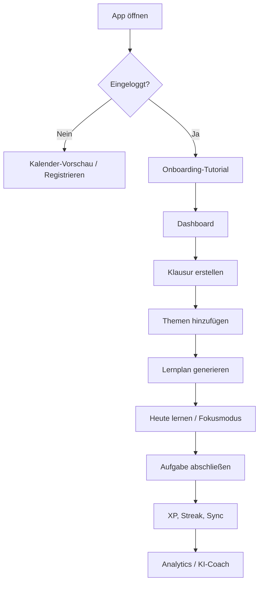

# Klausurplaner PWA

Klausurplaner ist eine mobile-first Progressive Web App für Schülerinnen und Schüler. Die App organisiert Klausuren, generiert Lernpläne, trackt Fortschritt und kombiniert Fokusmodus, Analytics, Gamification und einen KI-Coach.

Die App ist **über das MVP hinaus gewachsen**: Supabase-Auth, Cloud-Sync, Gast-Vorschau und ein geführtes Onboarding sind implementiert. Für ein produktionsreifes Produkt fehlen noch Tests, echtes Offline-Verhalten, Push im Hintergrund und mehrere Backend-/Sync-Härtungen — siehe [Bekannte Probleme & offene Punkte](#bekannte-probleme--offene-punkte).

## Stack

- React 19 + TypeScript
- Vite 7
- Zustand (Persist via LocalStorage)
- Supabase Auth + Postgres (Cloud-Sync)
- Tailwind CSS 4, lucide-react
- PWA: Web App Manifest + Service Worker

## Lokal starten

```powershell
npm install
cp .env.example .env   # Werte eintragen, siehe unten
npm run dev
```

Standard-URL (Port aus `.env`, Default `5177`):

```text
http://localhost:5177
```

Anderen Port erzwingen:

```powershell
npm run dev -- --port 5174
```

Produktionsbuild:

```powershell
npm run build
npm run preview
```

**Wichtig:** `VITE_*`-Variablen werden beim Build eingebettet. Für Deployments müssen sie in der CI/CD-Umgebung **vor** `npm run build` gesetzt sein. Nach Änderungen an `.env` den Dev-Server neu starten.

## Umgebungsvariablen

Kopiere `.env.example` nach `.env` und trage deine Werte ein:

```text
VITE_SUPABASE_URL=https://your-project-ref.supabase.co
VITE_SUPABASE_ANON_KEY=sb_publishable_your-key-here
VITE_GOOGLE_CLIENT_ID=your-google-client-id.apps.googleusercontent.com
VITE_AUTH_REDIRECT_URL=http://localhost:5177/dashboard
VITE_DEV_SERVER_PORT=5177
VITE_DEV_HMR_CLIENT_PORT=5177
VITE_SENTRY_DSN=optional-sentry-dsn

# Offline Read-Only Cache Access (Feature Flag, default: off)
VITE_ENABLE_OFFLINE_READONLY=false
VITE_OFFLINE_PUBLIC_KEY=
```

Server-only Werte gehoeren in Supabase Edge Function Secrets oder `.env.server`, nie in den Browser und nie mit `VITE_`:

```text
OFFLINE_READONLY_ENABLED=false
OFFLINE_SIGNING_KEY=
CLEANUP_CRON_KEY=
SUPABASE_SERVICE_ROLE_KEY=
```

**Production Guardrail:** Offline Read-Only Access ist vorbereitet, bleibt aber bis zur Staging-/Release-Readiness-Pruefung deaktiviert. In Production vorerst nicht setzen:

```text
VITE_ENABLE_OFFLINE_READONLY=true
OFFLINE_READONLY_ENABLED=true
```

### Supabase einrichten

1. Neues Supabase-Projekt anlegen.
2. Die Migrationen im Ordner `supabase/migrations/` in Supabase ausführen. Das geht entweder über die Supabase CLI oder durch manuelles Ausführen der Dateien (erst `20240101000000_init.sql`, dann `20240101000001_delete_account.sql`) im **SQL Editor**.
3. Unter **Settings → API Keys** die Publishable Key (oder legacy anon JWT) nach `VITE_SUPABASE_ANON_KEY` kopieren.
4. Optional: **Authentication → Providers → Google** aktivieren und Client-ID/Secret eintragen.
5. Unter **Authentication → URL Configuration** die Redirect-URL erlauben (z. B. `http://localhost:5177/dashboard`).

### Google Login

1. In Supabase `Authentication` → `Providers` → `Google` öffnen.
2. Google Provider aktivieren und Client-ID plus Client Secret eintragen.
3. In Supabase `Authentication` → `URL Configuration` die Redirect-URL erlauben.
4. In der Google Cloud Console dieselbe Redirect-URL für den OAuth-Client freigeben.

## Auth & Zugriffsmodell

| Zustand | Verfügbar |
|--------|-----------|
| **Gast** (ohne Account) | Nur Kalender-Vorschau mit Terminen |
| **Eingeloggt** | Dashboard, Klausuren, Lernplan, Coach, Fokus, Analytics, Settings, Cloud-Sync |
| **Offline Read-Only** (Feature Flag) | Letzter verschluesselter Snapshot, keine Bearbeitung, kein Supabase-Auth-Ersatz |

- Registrierung: `/signup` (E-Mail oder Google)
- Anmeldung: `/login`
- Nach dem ersten Login: geführtes Onboarding-Tutorial (11 Schritte, alle Hauptfunktionen)
- Auth-Session wird bei jedem Start serverseitig über Supabase validiert (kein vertrauenswürdiger Cache)

- Offline Read-Only entsperrt nur lokal gespeicherte Daten und erzwingt Lesemodus an der Store-/Datenebene.

## Aktuelle Funktionen

### Lernen & Planung
- Klausuren mit Fach, Datum, Uhrzeit, Raum, Notizen, Schwierigkeit, Wissensstand, Tagesminuten
- Themen mit Fortschritt in Prozent
- Automatischer Lernplan (Prioritätsformel, 70/20/10, Spaced Repetition: Tag 1, 2, 5, 10, 18)
- Manuelle Neuverteilung verpasster Aufgaben
- Lernmaterialien (Notizen, Links) pro Klausur — UI vorhanden, Upload noch begrenzt

### Produktivität & Motivation
- Dashboard: nächste Klausur, Countdown, XP, Level, Streak, Fokuszeit
- Kalender (Woche/Monat)
- Pomodoro-Fokusmodus (25/5)
- Analytics: Lernzeit, Fortschritt, Schwachstellen (Basis)
- Gamification: XP, Level, Badges, Streak

### KI & Cloud
- KI-Coach mit Modi: Coach, Quiz, Karteikarten, Plan, Erklären
- GLM + DeepSeek über Supabase Edge Function `ai-coach` (Mock-Fallback lokal)
- Supabase Cloud-Sync (Push/Pull mit Konfliktauflösung nach `updatedAt`)
- Browser-Benachrichtigungen (nur bei geöffneter App und erteilter Permission)

### UI
- Mobile-first, Bottom-Navigation + Sidebar
- Dark Mode
- Überarbeitete Fortschrittsbalken, Segmented Controls, deutsche Umlaute

## GLM KI mit DeepSeek-Fallback (Edge Function)

Die GLM- und DeepSeek-APIs werden nicht direkt aus dem Browser aufgerufen. Das Frontend ruft `supabase.functions.invoke("ai-coach")` auf; die Edge Function prüft das Supabase-Auth-JWT, validiert Eingaben und ruft erst GLM, dann DeepSeek auf. Erst wenn beide Provider fehlschlagen, nutzt das Frontend den lokalen Mock-Fallback.

Edge Function deployen:

```powershell
supabase login
supabase link --project-ref <dein-project-ref>
supabase secrets set GLM_API_KEY="<dein-zhipu-api-key>"
supabase secrets set GLM_MODEL="glm-4.7-flash"
supabase secrets set DEEPSEEK_API_KEY="<dein-deepseek-api-key>"
supabase secrets set DEEPSEEK_MODEL="deepseek-v4-flash"
supabase functions deploy ai-coach
```

Lokal testen:

```powershell
supabase functions serve ai-coach --env-file ./supabase/.env.local
```

`supabase/.env.local` nur lokal verwenden — nicht ins Frontend oder Git:

```text
GLM_API_KEY=...
GLM_MODEL=glm-4.7-flash
DEEPSEEK_API_KEY=...
DEEPSEEK_MODEL=deepseek-v4-flash
```

**Wichtig:** `GLM_API_KEY` und `DEEPSEEK_API_KEY` nie in `.env`, `.env.example` oder als `VITE_*` eintragen.

## Offline Read-Only Cache Access (Feature Flag)

Offline Read-Only Access ist browser-bound und dient nur dazu, zuvor synchronisierte Daten lokal zu lesen, wenn Supabase nicht erreichbar ist. Es ist **kein** Offline-Supabase-Auth, keine hardwaregebundene Device Identity und kein Ersatz fuer Revocation-Pruefungen im Online-Betrieb.

Status:

- Client-Flag: `VITE_ENABLE_OFFLINE_READONLY=false` per Default.
- Edge-Function-Flag: `OFFLINE_READONLY_ENABLED=false` per Default.
- Production bleibt deaktiviert, bis Staging-/Release-Readiness bestanden ist.

Registrierung:

1. Der Browser erzeugt ein exportierbares ECDSA-P-256 Device-Keypair in IndexedDB.
2. Die App berechnet `device_hash` als SHA-256 des SPKI Public Keys.
3. `get-device-challenge` erstellt eine 5-Minuten-Challenge fuer den angemeldeten Supabase-User.
4. `register-device` verifiziert Challenge-Signatur, Public-Key-Thumbprint und erstellt ein ES256 Offline Grant.
5. Der Offline Grant wird lokal gespeichert und verschluesselt den letzten Sync-Snapshot.

Cache-Schutz:

- Snapshots werden mit AES-256-GCM verschluesselt.
- Der Schluessel wird aus dem Offline Grant via PBKDF2 SHA-256 mit 100.000 Iterationen abgeleitet.
- Das schuetzt gegen beilaufige Inspektion. Wenn Browser Storage inklusive Grant kopiert wird, kann der Cache weiterhin entschluesselt werden.

Supabase Edge Functions:

```powershell
supabase secrets set OFFLINE_READONLY_ENABLED=false
supabase secrets set OFFLINE_SIGNING_KEY="<base64url-pkcs8-p256-private-key>"
supabase secrets set CLEANUP_CRON_KEY="<random-cron-secret>"
supabase functions deploy get-device-challenge
supabase functions deploy register-device
supabase functions deploy revalidate-grant
supabase functions deploy cleanup-expired-challenges
```

Cron/Vault:

```sql
select vault.create_secret('your-cleanup-cron-key', 'CLEANUP_CRON_KEY');
alter database postgres set app.settings.supabase_url = 'https://your-project-ref.supabase.co';
```

Manual cleanup test uses `net.http_post` directly or `select public.invoke_cleanup_expired_challenges();`; do not use `cron.schedule('now')`.

Release-readiness checklist for staging:

- Registration success.
- Replayed challenge rejected.
- Device hash mismatch rejected.
- Tampered grant rejected.
- Wrong signature rejected.
- Properly signed expired grant rejected.
- Valid grant revalidates online.
- Revoked grant returns `valid: false`.
- Network failure returns `null` locally, not `false`.
- Encrypted cache decrypts with the correct grant.
- Encrypted cache fails with the wrong grant.
- Offline mutation attempts fail at the data layer.

## Projektstruktur

```text
index.html
package.json
vite.config.ts
supabase-schema.sql          # Postgres-Schema + RLS
supabase/functions/ai-coach/ # Edge Function für KI
src/
  main.tsx
  App.tsx
  routes/AppRouter.tsx
  pages/                     # Dashboard, Calendar, Exams, Coach, …
  components/                # UI, AuthGuard, Tutorial, Navigation
  store/useAppStore.ts       # Zustand + Persist
  services/                  # syncService, aiService, studyPlanGenerator
  lib/                       # supabase, constants, navigation
  styles/globals.css
public/
  manifest.json
  service-worker.js
  icons/
```

## Architektur

```text
React UI (pages + components)
  ↓
Zustand Store (LocalStorage-Persist für Lern-Daten)
  ↓
Domain Services (Lernplan, Gamification, Sync, KI)
  ↓
Supabase (Auth + Postgres)     Edge Functions (ai-coach)
  ↓
PWA Layer (Manifest, Service Worker — Shell-Cache)
```

**Online-first:** Volle Funktionen erfordern Login und eine aktive Verbindung. LocalStorage dient als schneller lokaler Cache; die autoritative Cloud-Kopie liegt in Supabase nach erfolgreichem Sync.

## Lernplan-Algorithmus

Priorität:

```text
priorität = (schwierigkeit × 2) + (6 − wissensstand)
```

Verteilung: 70 % neue Inhalte · 20 % Wiederholung · 10 % Puffer

Spaced Repetition: Tag 1, 2, 5, 10, 18

## User Flow



## Bekannte Probleme & offene Punkte

Diese Liste beschreibt, was für ein **produktionsreifes Produkt jenseits des MVP** noch fehlt oder verbessert werden muss.

### Infrastruktur & Backend
- [x] **Datenbank-Setup manuell** — Migrationen befinden sich in `supabase/migrations/`.
- [x] **Keine CI/CD-Pipeline** — CI/CD Pipeline (GitHub Actions) mit Test und Build eingerichtet.
- [x] **Keine automatisierten Tests** — Unit-Tests (Vitest/Testing Library) für Store, Sync und Generator hinzugefügt.
- [x] **Deploy-Env** — Production-Builds und Secrets in der GitHub Actions CI dokumentiert und eingepflegt.

### Auth & Account
- [x] **Passwort zurücksetzen** — „Passwort zurücksetzen“-Flow im Settings-Menü implementiert.
- [x] **Account löschen** — RPC Call zum Löschen des Accounts und aller Cloud-Daten vorhanden.
- [ ] **E-Mail-Bestätigung** — Verhalten hängt von Supabase-Einstellungen ab; UX für unbestätigte Accounts noch minimal.
- [ ] **Session-Handling auf mehreren Geräten** — kein explizites Geräte-Management oder „überall abmelden“ außer globalem Sign-out.

### Sync & Daten
- [ ] **Sync-Strategie grob** — vollständiger Push/Pull-Snapshot statt inkrementeller Änderungen oder Realtime-Subscriptions.
- [x] **Konfliktauflösung simpel** — Tests für Last-Write-Wins (updatedAt) hinzugefügt.
- [x] **Kein Offline-Queue** — Änderungen offline werden nun vermerkt (`pendingOfflineChanges`) und bei Wiederherstellung der Verbindung asynchron gesynct.
- [ ] **Materialien / Dateien** — Schema und UI für PDFs/Notizen vorhanden, aber kein Upload in Supabase Storage, keine Vorschau, keine Größenlimits.
- [ ] **Seed-Daten für Gäste** — Kalender-Vorschau nutzt Demo-Daten; keine echte anonyme Cloud-Vorschau.

### Lernlogik & Features
- [ ] **Verpasste Aufgaben** — Neuverteilung nur manuell über Button, nicht automatisch beim App-Start oder per Cron.
- [ ] **Lernplan nicht adaptiv** — keine echte Schwachstellenanalyse oder dynamische Priorisierung aus Nutzungsdaten.
- [ ] **Analytics basic** — keine Exporte, keine Langzeit-Trends, keine Vergleiche zwischen Fächern.
- [ ] **Kein iCal/Google-Calendar-Export** — Klausurtermine nicht in externe Kalender integrierbar.
- [ ] **Keine Lerngruppen** — kein Teilen von Plänen, keine gemeinsamen Klausuren.

### KI
- [ ] **Edge Function Pflicht für echte KI** — ohne Deploy nur Mock-Antworten; kein Hinweis in der UI, welcher Provider aktiv ist (außer implizit).
- [ ] **Kein Rate-Limit-Feedback** — Nutzer sehen nicht, wenn KI-Kontingente erschöpft sind.
- [ ] **Kein Kontext aus Materialien** — Coach kennt hochgeladene PDFs/Notizen noch nicht.

### PWA & Benachrichtigungen
- [x] **Service Worker minimal** — Caching Strategie für App-Shell in public/service-worker.js via Stale-While-Revalidate optimiert.
- [ ] **Kein Web Push im Hintergrund** — Todo-Marker in Service Worker vorbereitet, Implementierung ausstehend.
- [x] **Kein Install-Prompt-Flow** — `beforeinstallprompt`-Event in `App.tsx` hinzugefügt, geführter Flow muss noch im UI angezeigt werden.

### UI & UX
- [ ] **Tutorial nicht überspringbar** — erzwungenes Onboarding beim ersten Login; kein „Später“ für erfahrene Nutzer.
- [ ] **Fehler-Feedback bei Sync** — Status-Badge zeigt „Sync Fehler“, Details nur in Settings; kein Retry-UI in der Hauptnavigation.
- [ ] **Barrierefreiheit** — keine systematische ARIA-/Tastatur-/Screenreader-Prüfung.
- [ ] **Internationalisierung** — nur Deutsch; keine i18n-Infrastruktur.

### Sicherheit & Betrieb
- [ ] **RLS Policies** — im Schema definiert, aber nicht automatisch in jedem Projekt verifiziert.
- [ ] **API-Key-Rotation** — keine Dokumentation für Wechsel von Publishable/Legacy-Keys in laufenden Deployments.
- [x] **Observability** — optionale Integration von @sentry/react in `main.tsx` verfügbar, konfigurierbar über `VITE_SENTRY_DSN`.

## Roadmap (kurz)

Priorität für die nächsten Ausbaustufen:

1. Automatisierte Supabase-Migrationen + CI mit Env-Secrets
2. Test-Suite (Sync, Auth, Lernplan-Generator)
3. Inkrementeller Sync + Offline-Queue
4. Web Push + Hintergrund-Erinnerungen
5. Datei-Upload (Supabase Storage) + KI-Kontext aus Materialien
6. Passwort-Reset, Account-Löschung, besseres Multi-Device-Verhalten
7. Adaptive Lernplanung und Kalender-Export

## Lizenz

Privates Projekt — siehe Repository-Inhaber.
