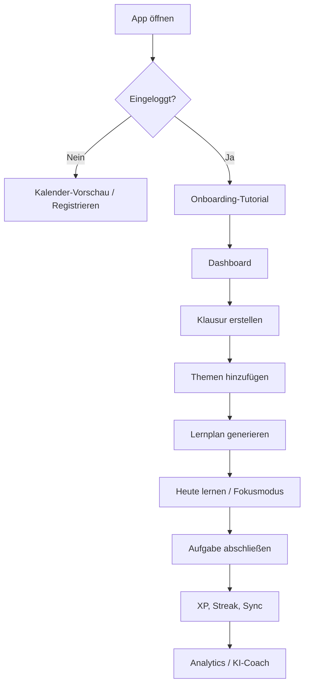

# Architektur & Projektstruktur

## Systemarchitektur

```text
React UI (pages + components)
  ↓
Zustand Store (LocalStorage-Persist für Lern-Daten)
  ↓
Domain Services (Lernplan, Gamification, Sync, KI)
  ↓
Supabase (Auth + Postgres)     Edge Functions (ai-coach)
  ↓
PWA Layer (Manifest, Service Worker — Shell-Cache)
```

**Online-first:** Volle Funktionen erfordern Login und eine aktive Verbindung. LocalStorage dient als schneller lokaler Cache; die autoritative Cloud-Kopie liegt in Supabase nach erfolgreichem Sync.

## Tech Stack

| Layer | Technologie |
|-------|-------------|
| UI Framework | React 19 + TypeScript |
| Build Tool | Vite 7 |
| State Management | Zustand (Persist via LocalStorage) |
| Backend / Auth | Supabase Auth + Postgres |
| Styling | Tailwind CSS 4, lucide-react |
| PWA | Web App Manifest + Service Worker |
| Testing | Vitest + Testing Library |
| Observability | Sentry (optional, via `VITE_SENTRY_DSN`) |

## Projektstruktur

```text
index.html
package.json
vite.config.ts
supabase/
  migrations/                # Postgres-Schema + RLS + Storage + Push
  functions/                 # Edge Functions (ai-coach, subscribe-push, send-push, ...)
src/
  main.tsx
  App.tsx
  routes/AppRouter.tsx
  pages/                     # Dashboard, Calendar, Exams, Coach, …
  components/                # UI, AuthGuard, Tutorial, Navigation
  store/useAppStore.ts       # Zustand + Persist
  services/                  # syncService, aiService, studyPlanGenerator, pushService, ...
  utils/                     # icalExport, analyticsExport, dateUtils, ...
  lib/                       # supabase, constants, navigation, i18n
  locales/                   # de.ts, en.ts
  styles/globals.css
public/
  manifest.json
  service-worker.js
  icons/
```

## User Flow



## Lernplan-Algorithmus

### Prioritätsformel

```text
priorität = (schwierigkeit × 2) + (6 − wissensstand)
```

### Verteilung

- 70 % neue Inhalte
- 20 % Wiederholung
- 10 % Puffer

### Spaced Repetition

Wiederholungsintervalle: Tag 1, 2, 5, 10, 18
